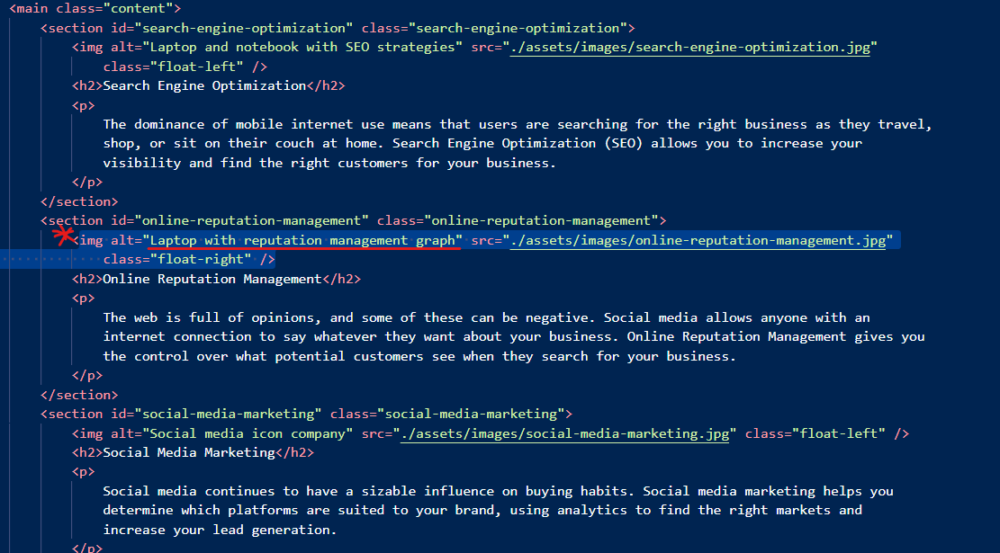

# SemanticWorkProject
First Challenge Semantics 
 - Adding the navigation to the section it should do
 - adding the alt descriptions for accessibility
Live @ https://maeldeis.github.io/Challenge1Semantic/ https://github.com/Maeldeis/Challenge1Semantic/tree/main

I made some improvements for readability and consistency. I also grouped related styles to make the code more modular and easier to maintain. Additionally, I adjusted some values for better responsiveness.

 I've made a few improvements to enhance accessibility, semantic structure, and overall readability. I've also added comments to explain certain sections.

 